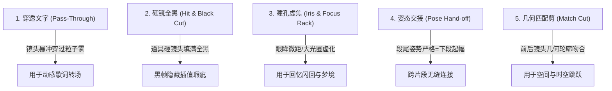

# MV 视听张力、表演与物理转场指南 (mv-audio-performance.md)

本文件定义**乐理张力映射表、口型表演配比、5 大高阶物理转场与跨段姿态连续性交接（Pose Hand-off）规范**。

---

## 一、乐理视听张力映射表 (Musical Structure Mapping)

MV 分镜的镜头功能必须严格跟随音乐的乐理结构，严禁按字数机械等分：

| 乐理段落 | 听觉能量特征 | 画面叙事任务 | 镜头运动与景别 | 剪辑率与动能 |
|---|---|---|---|---|
| **Intro (前奏)** | 氛围铺底、无鼓或单音乐器 | **5 秒黄金视觉钩子**：非常规第一帧（微距眼神、砸镜、倒放、神秘道具），建立世界观承诺 | 极远景建立 或 极特写引入，慢速推拉 | 节奏克制平缓，建立视觉基调 |
| **Verse (主歌)** | 叙事性人声、中低密度编曲 | **立人与立空间**：歌手中近景建立认同，或剧情角色开始行动，间接称呼为主 | 中景 (MS) / 侧面跟随 / 固定机位平视 | 稀疏，随单句歌词微动（内部节奏） |
| **Pre-Chorus / Build-up** | 和声上行、军鼓加密加压 | **视觉蓄势与加压**：机位明显靠近，光比变硬，主体动作幅度与张力递增 | 中近景 (MCU) 推进至近景，手持晃动感 | 剪辑率递增，**最强奇观留给副歌** |
| **Chorus / Drop** | 全频段爆发、强鼓点与贝斯 | **全片核心英雄画面 (Hero Visual)**：最开阔空间、最强舞台光效、最稳健编舞队形 | 大广角环绕 (Orbit) / 冲撞变焦 (Crash Zoom) | 强拍密集切镜，色彩与光效拉满 |
| **Post-Chorus / Dance Break** | 4~8 拍纯器乐高能轰鸣 | **Killing Part 记忆点**：标志性编舞特写、手部动作或高难度技巧展示 | 局部特写与全景队形极速交替 | 极高切镜率或一镜到底跟随 |
| **Bridge (桥段)** | 调性反转、空间置换 | **最大视觉破裂 (Disruption)**：空间彻底置换、色温完全翻转（如冷转暖）或动作停滞 | 极特写 (CU) 慢镜头 / 意象化隐喻 / 黑白单色 | 节奏骤变，形成巨大视听反差 |
| **Final Chorus (最终副歌)**| 编曲最丰富、全乐器轰鸣 | **合流与终极释放**：表演与叙事线合流释放，所有视觉母题升级汇聚 | 宏大全景与核心特写交替 / 烟火天光全开 | 视觉能量顶峰，完成情感终局 |
| **Outro (尾奏)** | 余音散去、单件乐器渐弱 | **意象定格与留白**：回到 Intro 母题闭环、动作收束、定格留白 | 镜头缓缓拉远升空 (Crane Up) 或 道具特写 | 画面渐隐、静止冻帧、留白收尾 |

---

## 二、流派自适应表演与镜头分配法则

MV 分镜的表演与镜头分配必须基于 `beats.md` 识别出的曲风流派自适应决策，严禁机械死板：

```text
                               ┌───────────────────────────────┐
                               │     全片 100% 镜头流派自适应分配 │
                               └──────────────┬────────────────┘
                                              │
         ┌────────────────────────────┼────────────────────────────┐
         ▼                            ▼                            ▼
  【编舞 / K-pop / 舞曲】     【舞台唱演 (流行/摇滚)】        【电影叙事 / 唯美意境】
  - 60%~80% 齐舞与队形变换     - 40%~50% MCU 歌手唱演         - 20%~30% 情感特写唱演
  - 标志性编舞 Killing Part    - 50%~60% 舞台光效与空镜       - 70%~80% 电影剧情弧与空镜
  - 多布景跳切与强拍卡点       - 聚焦主唱面部与舞台张力       - 纯器乐曲 100% 纯视觉
```

### 唱演与叙事交替铁律：
1. **严禁连续两段纯大头唱演**：无论何种流派，唱演段（MCU 对嘴）必须与视觉叙事段/齐舞段交替穿插，严禁连续两段都是纯面部对嘴（防止视觉审美疲劳）；
2. **表演场景图 100% 纯净无人**：唱演所使用的背景参考图必须为纯净无人空镜，杜绝任何路人干扰；
3. **唱演特写禁止手持麦克风遮挡嘴部**：在需要口型同步的 MCU 镜头中，Prompt 严禁写“手持麦克风靠近嘴巴”，防止手部或麦克风遮挡嘴部导致模型口型崩坏。

---

## 三、全片色彩脚本与视觉母题系统 (Color Script & Visual Motif)

### 1. 五大典型色彩弧线 (Color Arc)
分镜规划时必须为全片设定清晰的色彩演变轨迹，并在每个分段中注入具体的具名色彩词，**严禁使用空洞抽象词（如仅写"暖色调"）**：

| 色彩弧线类型 | 乐段演变路径 | 适用情绪与题材 | 典型乐段色彩关键词示例 |
|---|---|---|---|
| **cold_to_warm (冷转暖)** | 冷色/暗调 $\rightarrow$ 暖色/高饱和金光 | 治愈、破茧、觉醒、希望释放 | Intro: `深邃冷蓝与暗青` $\rightarrow$ Chorus: `高饱和金橙与琥珀光` $\rightarrow$ Outro: `柔和暖黄` |
| **warm_to_cold (暖转冷)** | 暖金/明亮 $\rightarrow$ 冷灰/深蓝/暗黑 | 离别、失落、黑暗结局、反转 | Intro: `温暖夕阳金` $\rightarrow$ Verse: `褪色莫兰迪灰` $\rightarrow$ Chorus: `冰冷铁灰与冷蓝` |
| **monochrome_to_color (黑白转彩色)** | 纯黑白/灰度 $\rightarrow$ 高饱和撞色爆发 | 觉醒、点燃、生命力爆发、Drop | Intro: `纯黑白高反差` $\rightarrow$ Drop: `荧光粉与电光蓝极速炸开` |
| **color_to_monochrome (彩色转黑白)** | 绚烂色彩 $\rightarrow$ 黑白剪影/虚无 | 回忆消散、终局落幕、虚无 | Intro: `绚烂霓虹` $\rightarrow$ Bridge: `高对比纯黑白剪影` |
| **cyclic (循环往复)** | 起始色 $\rightarrow$ 中段强烈对比 $\rightarrow$ 回归原色 | 循环、宿命、仪式感、首尾呼应 | Intro: `冷白极简` $\rightarrow$ Chorus: `黑金水火` $\rightarrow$ Outro: `回归纯白` |

### 2. 视觉母题 (Visual Motif) 贯穿法则
为了赋予整部 MV 顶级的电影感与统一主题，建议在分镜规划时确立 **1 个贯穿全片的具象视觉母题**，在关键乐段以不同物理状态演进：
- **Intro**：母题首次以静止/微距形态出现（如：`静止在水面的金色怀表` / `停在指尖的透明发光蝴蝶`）；
- **Chorus**：母题随音乐爆发被激活（如：`怀表指针随鼓点飞速倒转` / `万千蝴蝶在金光中振翅飞向高空`）；
- **Bridge**：母题发生空间异变或碎裂（如：`怀表如玻璃般碎裂为粒子` / `蝴蝶化为光雾消散`）；
- **Outro**：母题以定格或留白形态回归闭环（如：`碎屑在地面重新拼合定格` / `晨光中最后一枚光斑停留在掌心`）。

---

## 四、5 大高阶物理转场积木

严禁在段落间使用平庸的跨淡化（Dissolve/叠化）。必须使用以下 5 类具备物理理由的高阶转场：



### 转场具体语法与示例：
1. **穿透文字转场 (Pass-Through)**：
   * *语法*：`镜头以极高速度向前暴冲，穿过正在消散的发光文字粒子雾，穿过瞬间硬切至下一场景的主角面部。`
2. **砸镜全黑转场 (Hit & Black Mask Cut)**：
   * *语法*：`主角右手将麦克风/扇子/拳头猛烈挥向镜头填满画面至瞬间全黑；全黑瞬间硬切下一镜头，主角从黑影中收回手臂。`（完美隐藏模型插值瑕疵）。
3. **瞳孔/大光圈虚焦转场 (Iris & Focus Rack)**：
   * *语法*：`镜头极速推入主角眼眸中的金色光斑，画面瞬间过渡为全屏柔和光晕，顺势拉出新时空的场景。`
4. **姿态交接 (Pose Hand-off)**：
   * *语法*：见下文第五节。
5. **几何匹配剪 (Match Cut)**：
   * *语法*：`前一段段尾的圆窗构图，在强拍落下时无缝匹配切至后一段起幅的金色满月，保持视觉中轴一致。`

---

## 五、跨段姿态连续性交接规范 (Pose Hand-off Protocol)

多段视频拼接时，为彻底消除片段间的“人物瞬移”与“动作重演”，必须严格执行姿态交接协议：

1. **段尾收束内在化（写在最后一个微镜头末尾，严禁单独写「段尾状态：」标签）**：
   * 在第 N 段的最后一个微镜头里自然描述动作收尾与定点，例如：`镜头5：全员随末尾重音同时单手比出手枪手势定格指向镜头，眼神凌厉。`
   * **【红线禁令】严禁在 Prompt 中单独写一行独立的脚手架标签 `段尾状态：xxx保持静止`！** 单独写标签会导致生视频模型误解为全局静止指令，引发视频后半段画面冻结或人物僵死。
2. **下一段起幅严格承接 (Segment N+1 Start State)**：
   * 在第 N+1 段的第 1 个微镜头中自然承接该姿态，例如：`镜头1：承接上一段手枪定格姿态，随第一声重音四人瞬间甩臂展开齐舞，严禁重复起手动作。`
3. **动能方向一致**：
   * 若上一段末尾镜头向右平移，下一段起幅必须保持向右平移或瞬间硬切静止，严禁方向突变反转。
